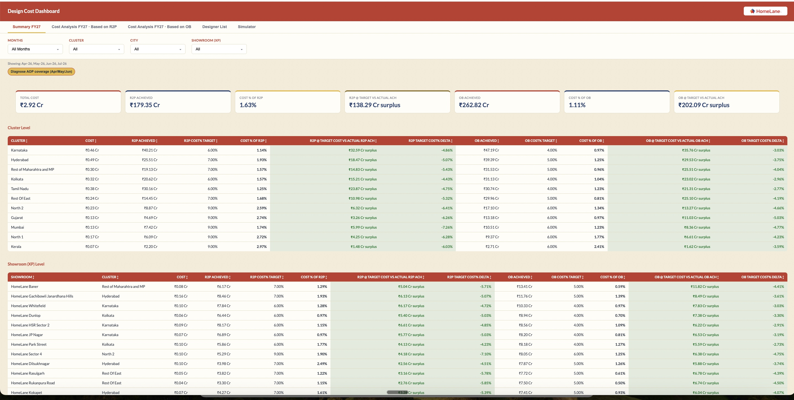

# Designer Cost Dashboard 💼

**A headcount planning and cost monitoring tool for design operations leadership**

Built for HomeLane, this tool gives cluster heads and business unit leaders a real-time view of designer cost as a percentage of Order Book (OB) and Ready-to-Production (R2P) revenue — with RAG status, showroom-level drill-downs, and a built-in simulator to model headcount decisions before making them.

---

## Screenshot

---

## The Problem It Solves

In a large design organisation with multiple seniority levels and clusters, managing workforce cost is complex:

- Different roles carry very different CTC costs (Design Associate at ₹28,800/month vs Sr. Principal Design Consultant at ₹1,04,167/month)
- Cost as a % of revenue fluctuates by cluster, showroom, and month
- Hiring or attrition decisions are often made without a clear view of their cost impact
- Leaders needed a real-time answer to: *"If I add 5 DCs in this cluster, what happens to my cost%?"*

Without this tool, these decisions relied on intuition or time-consuming manual Excel analysis.

---

## What It Does

The Designer Cost Dashboard gives ops leadership four views:

### 1. Overview (OB-based)
- Designer cost as % of Order Book, broken down by cluster and showroom
- RAG (Red / Amber / Green) status per cluster against group targets:
  - **Titans** (Karnataka, TN, Kolkata): **4%** target
  - **Stalwarts** (Maharashtra, Hyderabad, East): **5%** target
  - **Aspirants** (Gujarat, Mumbai, North): **6%** target
- Pan-India summary benchmarked against a flat 4.8% target
- Role-level cost component breakdown (Design Consultant, Associate, Manager, DCC, etc.)
- Showroom-level drill-down within each cluster card

### 2. Cost Analysis (R2P-based)
- Same structure as Overview, but benchmarked against R2P revenue instead of OB
- R2P targets: Titans 6%, Stalwarts 7%, Aspirants 9%, Pan-India 7.1%

### 3. Summary FY27
- YTD view across all available months, showing both OB% and R2P% side by side
- Cluster-level and showroom-level rows in a single consolidated table
- % Point delta vs target (positive = over target/red, negative = under target/green)

### 4. Current Month
- Latest month only — RAG status per cluster with budget gap analysis
- Shows: Target OB needed to justify current spend, OB already achieved, and the gap

### Simulator
- **Fix OB → optimise headcount**: Given a revenue target, what is the ideal headcount mix?
- **Fix headcount → find OB needed**: Given current headcount, what OB is needed to stay within target?
- Scoped to selected clusters/showrooms

---

## Cost Sources

The dashboard uses a hybrid cost model:

| Role | Source |
|---|---|
| Design Consultant (all tiers) | Live headcount × CTC from Active HC tab |
| Design Associate | Live headcount × CTC from Active HC tab |
| Design Manager | DM List tab (COUNTA of DM column) |
| DCC Associate | DCC Associate tab (active = no LWD) |
| DCC Lead | Fixed: 7 headcount × ₹85,000/month |
| DCC Principal | Fixed: 7 headcount × ₹85,000/month |
| Measurement Executive | AOP Sheet (actuals Apr–Jun, averaged proxy for other months) |
| Design Incentive | AOP Sheet |
| Design Attrition/Retention | AOP Sheet |
| Design Partner | AOP Sheet |
| Community Manager | AOP Sheet |

---

## CTC Assumptions

| Role | Monthly CTC (₹) |
|---|---|
| Design Associate | 28,800 |
| Design Consultant | 42,833 |
| Sr. Design Consultant | 58,333 |
| Principal Design Consultant | 75,000 |
| Sr. Principal Design Consultant | 1,04,167 |
| DCC Associate | 20,000 |
| Design Manager | 85,000 |
| DCC Lead / DCC Principal | 85,000 |

---

## Tech Stack

| Layer | Technology |
|---|---|
| App framework | Google Apps Script (HTML Service) |
| Data sources | Google Sheets (multiple tabs — OB, R2P, Active HC, DM List, AOP Sheet) |
| Auth | Password-protected session with 6-hour token (CacheService) |
| Deployment | Apps Script Web App |
| Access control | Password gate — ops leadership only |

---

## Google Sheet Tab Requirements

| Tab Name | Purpose |
|---|---|
| `OB Data MOM -FY 27` | Monthly Order Book data by cluster and showroom |
| `R2P Data MOM -FY 27` | Monthly Ready-to-Production data |
| `Active HC` | Current headcount snapshot by showroom and role |
| `DM List` | Design Manager headcount by cluster |
| `DCC Associate` | DCC Associate active headcount |
| `DCC DM & PD` | DCC Lead and Principal (used for diagnostics; headcount is hardcoded) |
| `AOP Sheet` | AOP cost actuals for Apr–Jun (Measurement Exec, DCC, Incentives, Attrition, Partner) |
| `Designer List` | Full designer roster for the Designer List tab |
| `Cluster-City-XP` | City → showroom mapping for the City filter |

---

## Setting Up

**Step 1 — Configure password**

Run `ONE_TIME_setPassword()` from the Apps Script editor to set the dashboard password. Change `'ChangeMe123'` to your own password before running.

**Step 2 — Deploy as Web App**

1. Open your Google Sheet → **Extensions → Apps Script**
2. Paste `Code.gs` and create `Index.html` with the UI code
3. Deploy → New Deployment → Web App
4. Execute as: **Me** | Access: **Anyone with link** (or restrict to org)

**Step 3 — Share URL**

Share the web app URL with ops leadership. They enter the password to access the dashboard.

---

## Cluster Groups & Targets

| Group | Clusters | OB Target | R2P Target |
|---|---|---|---|
| Titans | Karnataka, Tamil Nadu, Kolkata | 4.0% | 6.0% |
| Stalwarts | Maharashtra, Hyderabad, Rest of East | 5.0% | 7.0% |
| Aspirants | Gujarat, Mumbai, North 1, North 2, Kerala | 6.0% | 9.0% |
| Pan India | All | 4.8% | 7.1% |

---

## Business Value

- Enables data-driven headcount decisions — leaders can model the cost impact of adding or removing roles before acting
- Real-time RAG view prevents cost overruns at cluster level before they compound at BU level
- Reduces time to generate cost analysis from hours (manual Excel) to seconds
- Showroom-level drill-down identifies exactly which XP is driving a cluster's cost overrun
- Directly supports design cost reduction programme — cost reduced from ~8% to ~7% of revenue
- Applicable across HomeLane's full national network of showrooms

---

## About the Author

Built by [Mathen Thomas](https://www.linkedin.com/in/mathen-thomas-b0121018/) — AVP Business Operations & Program Office, leading AI-first design operations for 750+ designers across India.

> This repository contains a sanitised version of the production tool. Actual headcount data, CTC configurations, password, and Google Sheet IDs have been removed. The `Index.html` UI file is not included in this public repository.
